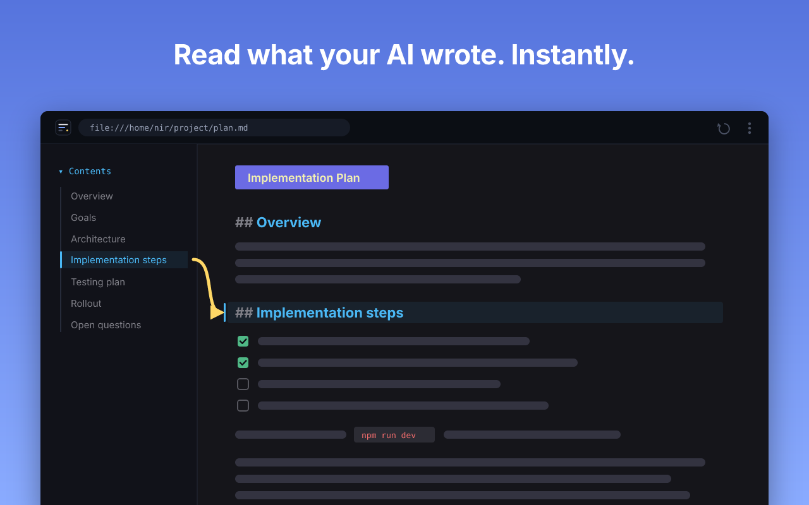
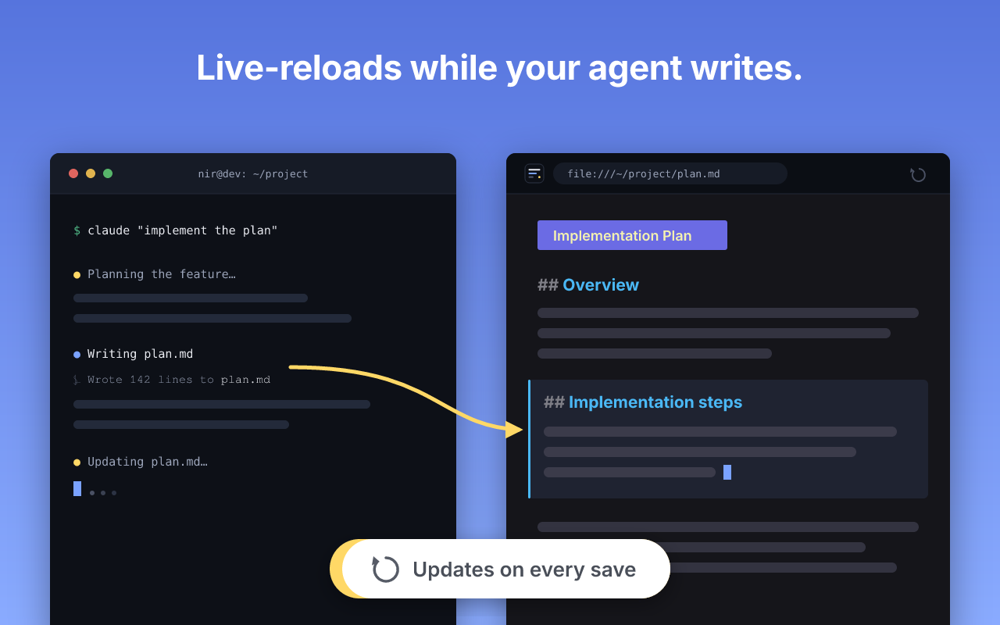
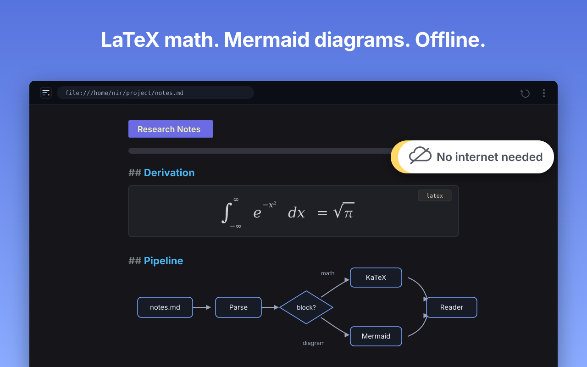
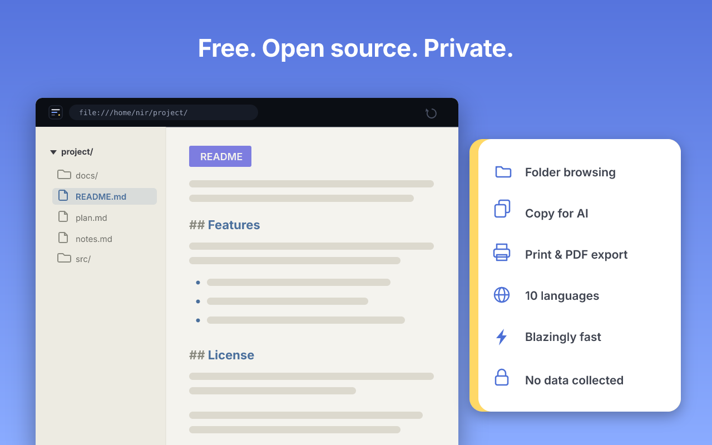
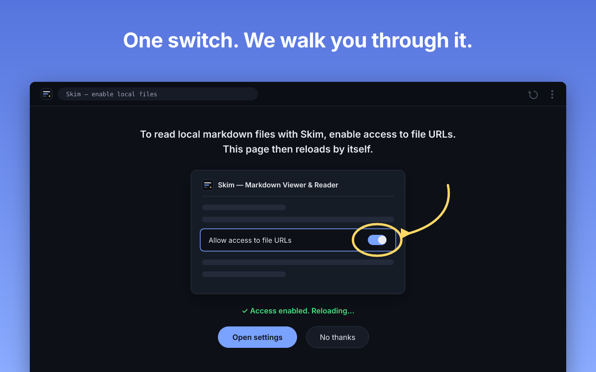

<div align="center">

# Skim

### Read what your AI wrote. Instantly.

<video src="https://github.com/user-attachments/assets/0900f307-c365-49f7-a841-f37556aa8a82" width="860" controls autoplay loop muted playsinline>
  
</video>

Beautiful Markdown in your browser. Local files, URLs, and everything your AI agents keep writing.

<br>

[![Visit skim.md][visit-badge]][site]
&nbsp;
[![Open the reader][reader-badge]][reader]

<br>

**Add to your browser**

[![Add to Chrome][chrome-badge]][chrome-store]
&nbsp;
[![Add to Firefox][firefox-badge]][firefox-store]
&nbsp;
[![Add to Edge][edge-badge]][edge-store]

[Every install option →][install-all]

<br>

[](#license)
[](#)
[](#)

</div>

---

<div align="center">

### Writes while you read.



Skim watches the file and re-renders in place the moment it changes.

<br>

### Math and diagrams. Offline.



KaTeX and Mermaid, rendered locally. Nothing leaves your machine.

<br>

### Every feature. Free.



No Pro tier, no paywall, no account.

</div>

---

## Install

<div align="center">

[![Add to Chrome][chrome-badge]][chrome-store]
&nbsp;
[![Add to Firefox][firefox-badge]][firefox-store]
&nbsp;
[![Add to Edge][edge-badge]][edge-store]

Prefer not to install? Open any file in the online reader at **[skim.md/viewer][reader]**.
Every option, per browser, lives at **[skim.md/install][install-all]**.



</div>

<details>
<summary><b>Install unpacked (from source)</b></summary>

<br>

The repo ships a built `dist/` and `vendor/`, so no build is needed.

1. Open `chrome://extensions`
2. Enable **Developer mode** (top right)
3. **Load unpacked** → select this folder

To read local `.md` files, the popup walks you through the one Chrome switch it needs ("Allow access to file URLs").

</details>

<details>
<summary><b>Everything Skim does</b></summary>

<br>

- **GitHub-flavored Markdown** — tables, task lists, strikethrough, autolinks.
- **KaTeX math** — `$inline$` and `$$block$$`, plus bare LaTeX environments (`\begin{align}…`), rendered offline. Double-click any formula to copy its LaTeX.
- **Syntax-highlighted code** with a copy button on every block.
- **Mermaid diagrams** — ` ```mermaid ` fences render as diagrams, lazy-loaded so pages without them pay nothing.
- **YAML frontmatter** rendered as a clean header card instead of raw `---` text.
- **Auto-reload** — re-renders in place when the file changes on disk, with fallback transports and a silent failure mode so it never breaks the page.
- **Copy for AI** — turn the whole rendered document back into clean markdown, ready to paste into your next prompt.
- **Table of contents** sidebar with scrollspy.
- **Light and dark themes**, plus a density setting, synced across devices via `chrome.storage.sync`.
- **Reading zoom** (opt-in).
- **Hebrew/English bidi** — each block picks its own text direction for mixed RTL/LTR documents.
- **Raw source view** and **copy-selection-as-markdown**.
- **Print / export to PDF** with print-friendly styling.
- **Tab / Shift+Tab** to step through the document block by block (and through table rows).
- **Folder view** — enhances `file://` directory listings, plus a Folder button to jump to a file's containing folder.
- **Force-render from the popup** — turn any page into a rendered markdown view on demand.
- **Robust encoding handling** — UTF-8/UTF-16 BOM detection, windows-1252/1255 heuristics for undeclared legacy encodings.
- **Large-file guard** so huge documents don't lock up the tab.

Supported: `.md`, `.markdown`, `.mdown`, `.mkd`, `.mkdn`, `.mdx`, from `file://` and from `http(s)://` when the server sends the file as plain text (most static hosts, including GitHub raw and CDNs, do).

</details>

<details>
<summary><b>How it works</b></summary>

<br>

Skim only acts when Chrome is showing a markdown file as plain text (both `file://` and most static hosts serve `.md` as `text/plain` or `text/markdown`). A content script:

1. Detects the plaintext markdown page and its encoding (`src/detect.js`, `src/encoding.js`).
2. Extracts the raw source, pulls out YAML frontmatter (`src/frontmatter.js`), parses with `marked`, renders math with KaTeX, highlights code with highlight.js, and sanitizes the result with DOMPurify (`src/render.js`, `src/table.js`).
3. Replaces the page with a styled article and mounts the UI: TOC, toolbar, theme/zoom, copy buttons, print, Copy-for-AI (`src/ui.js`, `src/main.js`, `src/nav.js`, `src/print.js`, `src/copy-markdown.js`, `src/skim.css`).
4. Watches the file for changes and re-renders in place (`src/reload.js`).

Markdown served as `text/html` or as a forced download is **not** intercepted. Mermaid renders from a separate, lazily-loaded bundle (`src/mermaid.js`, `src/mermaid-entry.js`). A separate content script (`src/folder.js`) enhances `file://` directory listings. The popup, options, and onboarding pages share a settings module (`src/settings.js`) backed by `chrome.storage.sync`.

</details>

<details>
<summary><b>Build &amp; develop</b></summary>

<br>

The repo ships a built `dist/` and `vendor/`, so installing unpacked needs no build. To rebuild after editing `src/`:

```bash
npm install
npm run build            # bundle content scripts + vendor KaTeX/mermaid assets
npm test                 # run the unit tests (node --test)
npm run size             # check the shipped package against its size budget
node scripts/preview.mjs examples/sample.md   # write preview.html to eyeball
```

</details>

---

<div align="center">

**MIT** · No data collected · [github.com/skim-md/skim](https://github.com/skim-md/skim)

</div>

<!-- link & badge references -->

[site]: https://skim.md
[reader]: https://skim.md/viewer
[install-all]: https://skim.md/install
[chrome-store]: https://chromewebstore.google.com/detail/skim-markdown-viewer/PLACEHOLDERSKIMID
[firefox-store]: https://addons.mozilla.org/en-US/firefox/addon/skim-markdown-viewer/
[edge-store]: https://microsoftedge.microsoft.com/addons/detail/PLACEHOLDERSKIMID

[visit-badge]: https://img.shields.io/badge/-Visit%20skim.md-8b7cff?style=for-the-badge&logoColor=white
[reader-badge]: https://img.shields.io/badge/-Open%20the%20reader-7C6CF0?style=for-the-badge&logo=markdown&logoColor=white
[chrome-badge]: https://img.shields.io/badge/-Add%20to%20Chrome-4285F4?style=for-the-badge&logo=googlechrome&logoColor=white
[firefox-badge]: https://img.shields.io/badge/-Add%20to%20Firefox-FF7139?style=for-the-badge&logo=firefoxbrowser&logoColor=white
[edge-badge]: https://img.shields.io/badge/-Add%20to%20Edge-0078D7?style=for-the-badge&logo=data%3Aimage%2Fsvg%2Bxml%3Bbase64%2CPHN2ZyB4bWxucz0iaHR0cDovL3d3dy53My5vcmcvMjAwMC9zdmciIHZpZXdCb3g9IjAgMCAyNCAyNCIgZmlsbD0iI2ZmZiI%2BPHBhdGggZD0iTTIxLjg2IDE3Ljg2cS4xNCAwIC4yNS4xMi4xLjEzLjEuMjV0LS4xMS4zM2wtLjMyLjQ2LS40My41My0uNDQuNXEtLjIxLjI1LS4zOC40MmwtLjIyLjIzcS0uNTguNTMtMS4zNCAxLjA0LS43Ni41MS0xLjYuOTEtLjg2LjQtMS43NC42NHQtMS42Ny4yNHEtLjkgMC0xLjY5LS4yOC0uOC0uMjgtMS40OC0uNzgtLjY4LS41LTEuMjItMS4xNy0uNTMtLjY2LS45Mi0xLjQ0LS4zOC0uNzctLjU4LTEuNi0uMi0uODMtLjItMS42NyAwLTEgLjMyLTEuOTYuMzMtLjk3Ljg3LTEuOC4xNC45NS41NSAxLjc3LjQxLjgyIDEuMDIgMS41LjYuNjggMS4zOCAxLjIxLjc4LjU0IDEuNjQuOS44Ni4zNiAxLjc3LjU2LjkyLjIgMS44LjIgMS4xMiAwIDIuMTgtLjI0IDEuMDYtLjIzIDIuMDYtLjcybC4yLS4xLjItLjA1em0tMTUuNS0xLjI3cTAgMS4xLjI3IDIuMTUuMjcgMS4wNi43OCAyLjAzLjUxLjk2IDEuMjQgMS43Ny43NC44MiAxLjY2IDEuNC0xLjQ3LS4yLTIuOC0uNzQtMS4zMy0uNTUtMi40OC0xLjM3LTEuMTUtLjgzLTIuMDgtMS45LS45Mi0xLjA3LTEuNTgtMi4zM1QuMzYgMTQuOTRRMCAxMy41NCAwIDEyLjA2cTAtLjgxLjMyLTEuNDkuMzEtLjY4LjgzLTEuMjMuNTMtLjU1IDEuMi0uOTYuNjYtLjQgMS4zNS0uNjYuNzQtLjI3IDEuNS0uMzkuNzgtLjEyIDEuNTUtLjEyLjcgMCAxLjQyLjEuNzIuMTIgMS40LjM1LjY4LjIzIDEuMzIuNTcuNjMuMzUgMS4xNi44My0uMzUgMC0uNy4wNy0uMzMuMDctLjY1LjIzdi0uMDJxLS42My4yOC0xLjIuNzQtLjU3LjQ2LTEuMDUgMS4wNC0uNDguNTgtLjg3IDEuMjYtLjM4LjY3LS42NSAxLjM5LS4yNy43MS0uNDIgMS40NC0uMTUuNzItLjE1IDEuMzh6TTExLjk2LjA2cTEuNyAwIDMuMzMuMzkgMS42My4zOCAzLjA3IDEuMTUgMS40My43NyAyLjYyIDEuOTMgMS4xOCAxLjE2IDEuOTggMi43LjQ5Ljk0Ljc2IDEuOTYuMjggMSAuMjggMi4wOCAwIC44OS0uMjMgMS43LS4yNC44LS42OSAxLjQ4LS40NS42OC0xLjEgMS4yMi0uNjQuNTMtMS40NS44OC0uNTQuMjQtMS4xMS4zNi0uNTguMTMtMS4xNi4xMy0uNDIgMC0uOTctLjAzLS41NC0uMDMtMS4xLS4xMi0uNTUtLjEtMS4wNS0uMjgtLjUtLjE5LS44NC0uNS0uMTItLjA5LS4yMy0uMjQtLjEtLjE2LS4xLS4zMyAwLS4xNS4xNi0uMzUuMTYtLjIuMzUtLjUuMi0uMjguMzYtLjY4LjE2LS40LjE2LS45NSAwLTEuMDYtLjQtMS45Ni0uNC0uOTEtMS4wNi0xLjY0LS42Ni0uNzQtMS41Mi0xLjI4LS44Ni0uNTUtMS43OS0uODktLjg0LS4zLTEuNzItLjQ0LS44Ny0uMTQtMS43Ni0uMTQtMS41NSAwLTMuMDYuNDVULjk0IDcuNTVxLjcxLTEuNzQgMS44MS0zLjEzIDEuMS0xLjM4IDIuNTItMi4zNVE2LjY4IDEuMSA4LjM3LjU4cTEuNy0uNTIgMy41OC0uNTJaIi8%2BPC9zdmc%2B
